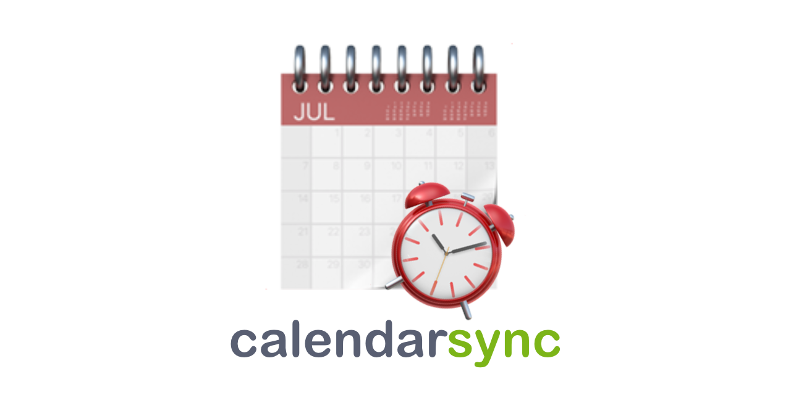

<div align="center">
	
	<p align="center">
    	Tool to sync multiple calendars from different sources into one Free/Busy calendar 📆
		<br/>
		<a href="#question-about-this-project">About This Project</a>
		·
		<a href="#sparkles-features">Features</a>
		·
		<a href="#hammer_and_wrench-setuprunning">Setup/Running</a>
		·
		<a href="#whale-docker">Docker</a>
		·
		<a href="#books-resources">Resources</a>
  	</p>
	<br/>
</div>
<br/>

# :question: About This Project
I started this project since I had the problem that there wasn't a publicly available (free) software that synchronized multiple calendars into one Free/Busy calendar. So I set out on a mission to develop such a tool. This tool uses multiple CalDav servers as input and copies all the busy/opaque events to one or multiple other calendars. The software is made to run in a Docker container on a refresh interval.

# :sparkles: Features
- [X] Syncing Multiple Calendars Into Free/Busy Calendars
- [X] Exporting Multiple Free/Busy Calendars
- [X] Syncing Automatically On An Interval

# :hammer_and_wrench: Setup/Running
This section describes the basic setup and running of the software.

```
calsync [-c CONFIG] [-i INTERVAL] [-wb WEEKS_BACK] [-wf WEEKS_FORWARD]

Syncs calendars from multiple services into one busy/free calendar

optional arguments:
  -c CONFIG, --config CONFIG
                        Path to config file
  -i INTERVAL, --interval INTERVAL
                        Interval in minutes to sync
  -wb WEEKS_BACK, --weeks-back WEEKS_BACK
                        Number of weeks to sync back
  -wf WEEKS_FORWARD, --weeks-forward WEEKS_FORWARD
                        Number of weeks to sync forward
```
Some optional arguments can also be passed as environment variables:
- `WEEKS_FORWARD`	= `CALENDARSYNC_WEEKS_FORWARD`
- `WEEKS_BACK`		= `CALENDARSYNC_WEEKS_BACK`
- `INTERVAL`		= `CALENDARSYNC_INTERVAL`

> ⚠️ When adding calendars to the *calendars* list that don't exist, you will get a warning, but the sync will proceed.

> ⚠️ Calendar names in the *calendars* or *aggregate* list can't include ","

## iCloud
1. Go to [appleid.apple.com](https://appleid.apple.com/account/home)
2. Under ***Sign-In and Security*** go to ***App-Specific Passwords***
3. Add a new Password and copy it to your config

```ini
[iCloud]
username=your@email.com			; Your iCloud Login E-Mail Address
password=xxxx xxxx xxxx xxxx	; The App-Specific Password you just created
calendars=Work,Private,...		; The Calendars you want to sync
aggregate=Free/Busy,...			; The Calendars you want to aggregate to
```
> ⚠️ When adding a clalendar to the *aggregate* list, that doesn't exist, it will be created.

## Google
1. Go to [myaccount.google.com](https://myaccount.google.com)
2. Under ***Security*** select ***2-Step Verification***
3. At the bottom of the page select ***App passwords*** (this is only possible if ***2-Step Verification*** is enabled)
4. Add a new password and copy it to your config

```ini
[Google]
username=gmail@email.com		; Your Google Login E-Mail Address
password=xxxx-xxxx-xxxx-xxxx	; The App-Password you just created
calendars=Work,Private,...		; The Calendars you want to sync
aggregate=Free/Busy,...			; The Calendars you want to aggregate to
```
> ⚠️ When adding a calendar to the *aggregate* list, that doesn't exist, an error occurs and the sync **will fail!**

# :whale: Docker
The easiest way to run the software is as a Docker container. There are 2 ways you can achieve this.

> ⚠️ With these configurations, the config.ini needs to be placed inside the *settingsfolder*

## Command Line
```sh
docker build --tag calendarsync

# With Default Synchronization Values
docker run --name yourcontainername -v /path/to/settingsfolder:/app/settings calendarsync

# With Custom Synchronization Values
docker run --name yourcontainername -v /path/to/settingsfolder:/app/settings -e CALENDARSYNC_WEEKS_FORWARD=2 -e CALENDARSYNC_WEEKS_BACK=2 -e CALENDARSYNC_INTERVAL=15 calendarsync
```

## Docker Compose
```yml
version: '3'

services:
  calendarsync:
    container_name: calendarsync
    build: .
    environment:
      - CALENDARSYNC_INTERVAL=15
      - CALENDARSYNC_WEEKS_BACK=2
      - CALENDARSYNC_WEEKS_FORWARD=2
    volumes:
      - /path/to/settingsfolder:/app/settings
```

# :books: Resources
- [Connection to Google Calendar](https://blog.lasall.dev/post/tell-me-why-google-and-caldav)
- [CalDav Library](https://github.com/python-caldav/caldav/tree/master)

---
<table style="width: 100%; border: none;" cellspacing="0" cellpadding="0" border="0">
	<tr>
		<td>If you like this project you can buy me a coffee 😄 Would be greatly appreciated!</td>
		<td><a href="https://www.buymeacoffee.com/pauldev" target="_blank"></a>
		</td>
	</tr>
</table>
